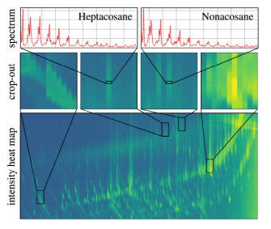

# Identity Verification from Human Scent Using Channel Representation of 2D Gas Chromatography-Mass Spectrometry Data

[project page](https://cmp.felk.cvut.cz/~spetlrad/identity_verification_from_human_scent.html) | [paper](https://cmp.felk.cvut.cz/~spetlrad/Spetlik26-ScentId.pdf)

This repository accompanies [a paper](https://cmp.felk.cvut.cz/~spetlrad/identity_verification_from_human_scent.html) accepted to WACV 2026 (to appear in Proceedings of the IEEE/CVF Winter Conference on Applications of Computer Vision, 2026) by
[Radim Spetlik](https://orcid.org/0000-0002-1423-7549),
[Jan Hlavsa](https://orcid.org/0009-0003-6108-4180),
[Jana Čechová](https://orcid.org/0000-0002-5213-3230),
[Petra Pojmanová](https://orcid.org/0000-0001-7117-7928),
[Jiří Matas](https://orcid.org/0000-0003-0863-4844), and
[Štěpán Urban](https://orcid.org/0000-0002-4566-4930).



## Description

**TL;DR.** We treat raw GC×GC–ToF-MS measurements as *multi‑channel images* by compressing each local mass spectrum into a small bank of learned channels. We then learn metric embeddings and evaluate ten embedding methods and five alignment strategies for *odor‑based identity verification*. On our human‑scent dataset of **252 individuals / 2,528 raw samples (~7.5 TB)**, the best method achieves **≈ 53% TPR @ 5% FPR (AUROC ≈ 89.5%)** *without* explicit spatial registration. This suggests feasibility for scenarios where cooperation or line‑of‑sight is limited and indicates that, under our drift regime, explicit registration is not necessary. 

---

## Repository structure

We provide **four groups of scripts**, each in its own directory:

* **`channels_representation/`**

  * `run.sh` — trains the channel representation. **Caution:** the training code loads a **single `.cdf` file (~4 GB)** per GPU; use a **large cluster** for channel‑representation training (we used the **LUMI supercomputer**, access via **IT4Innovations**, whom we gratefully acknowledge).
  * `store.sh` — converts raw `.cdf` GC×GC measurements into *channel representations* and stores them as **HDF5** according to a YAML config. These HDF5s are the input for the neural network training in `verification/`.

* **`verification_chemistry_baseline/`**

  * `run.sh` — runs the **analytical‑chemistry baseline** experiments we compare against in the paper.

* **`verification_deterministic/`**

  * `run.sh` — runs the **deterministic (hand‑engineered) baseline** experiments used in the paper.

* **`verification/`**

  * `trn.sh` — trains the **neural verification network** on the HDF5 channel representations.

Implementation notes (paper): channel representation uses a bank of learnable kernels (e.g., Gaussians) to compress spectra; embeddings are trained with triplet loss; we benchmark off‑the‑shelf CNN backbones and a lightweight custom CNN with anisotropic kernels reflecting GC×GC peak geometry. See Methods & Table 1 for details. 

---

## Quick start (Singularity only)

We **support only Singularity environments** for reproducibility and HPC portability.

First, modify appropriately paths in `config.sh` to point to correct directories.
Possibly the most important one is `SCRIPT_DIR`, which should point to the root of this repository.
Next, the `SINGULARITY_DIR` should point to the directory where you want to store the singularity container (if you want to build it).
Last, but not least, set `DATASET_DIR` to the path where you have stored the whole WACV2026 package, not just the Human Scent Dataset (HSD); see the **Data** section below for dataset access instructions.
Also, set `EXPERIMENTS_DIR`, where intermediate results, models, and logs will be stored and loaded from!

Then, follow these steps:

1. **Build the container**

   ```bash
   ./singularity_build.sh
   ```

   The container encapsulates Python, CUDA, and scientific packages.
2. **Prepare data**
   We provide no data in this repository; see the **Data** section below for dataset access instructions.
   Once obtained, be sure to set `DATASET_DIR` in `config.sh` to the path where you stored the dataset.
   Note that we provide pretrained channel-representation weights as part of the dataset download.
   Due to the dataset size (~7.5 TB), we do not provide any intermediate processed data.
    
3. **Run any script ... scripts assume image is already built**

We trained on **A100 (40 GB)** and **MI250x (64 GB)** GPUs; adjust resources accordingly. 

> **Why containers?** Containers make dependency management consistent on clusters. The structure and workflow are the same style we used before (build image; `exec` to run train/eval scripts). 

---

## Data

**Dataset home:** [https://vrg.fel.cvut.cz/uct_scent/](https://vrg.fel.cvut.cz/uct_scent/)
**Access:** credentials are required (email template below).

### What’s inside

* **Human Scent Dataset (HSD):**

  * **252 identities**, **2,528 raw samples**, totaling **~7.5 TB**.
  * Mixture of high‑ and low‑resolution acquisitions from Pegasus® instruments (BT 4D and 4D‑C).
  * Includes previously published 4D‑C subset (504 samples / 40 identities) + 2,024 newly collected samples (212 identities).
  * Typical raw **GC×GC–ToF‑MS files average ~3 GB** each; end‑to‑end measurement/export is time‑intensive.
    These figures and acquisition details are documented in Secs. 4–5 of the paper. 

* **Pretrained channel representation weights.** To avoid retraining the channel representation from scratch (which requires large‑scale HPC), we provide pretrained weights for 5-channel representation and both Gaussian and Triangle kernels as part of the dataset download.
* **Additional configuration files.** Configs for channel representation storage and verification training are included.
    
### Requesting access (email template)

Please email **[spetlrad@fel.cvut.cz](mailto:spetlrad@fel.cvut.cz)** with the subject **“HSD access request – YourName/Institution”** and include:

```
Dear all,

I would like to request credentials for the Human Scent Dataset (HSD) at https://vrg.fel.cvut.cz/uct_scent/.

Name:
Affiliation / research group:
Position:
Project / intended use:
Will you share derived models or code? (Y/N; brief plan)
Compute resources available (GPUs, storage quota):
Agreement to the dataset terms (no redistribution; cite the WACV 2026 paper; responsible use): Yes

I understand the dataset is large (~7.5 TB) and agree to handle it responsibly.

Best regards,
<Your Name>
```

---

## Working with `.cdf` files

* **Format.** The raw GC×GC–ToF‑MS exports are vendor `.cdf` (NetCDF) files; per‑sample size is ~3–4 GB. Our **`channels_representation/store.sh`** converts these into compact **HDF5** *channel representations* for downstream training. 
* **GPU memory & I/O.** Training the channel representation **loads one `.cdf` per GPU**; use nodes with fast local SSD and enough CPU RAM to buffer I/O.
* **Alignment.** Although canonical frame registration is common, our results show **no performance gain from explicit registration** on HSD; modern embeddings learned on unaligned data reached the best results. (Robustness under stronger drift remains an open question.) 

---

## Reproducing paper results

1. **Train / select channel representation**

   ```bash
   cd channels_representation
   ./run.sh
   ```

   This learns kernels (e.g., Gaussians) that compress per‑pixel spectra into **C channels**. 

2. **Materialize channel HDF5s**

   ```bash
   cd channels_representation
   ./store.sh
   ```

   Uses YAML config to map raw `.cdf` to channel HDF5.

3. **Run baselines**

   ```bash
   # Analytical-chemistry baseline
   cd verification_chemistry_baseline
   ./run.sh

   # Deterministic (hand-engineered) baseline
   # NOT INCLUDED due to storage complications; if interested, contact us.
   ```

4. **Train the verification network**

   ```bash
   cd verification
   ./trn.sh
   ```

   Embeddings are trained with **triplet loss**; we report **TPR@5%FPR** and **AUROC** across 10‑fold identity‑ and gender‑aware splits, as in the paper. Best results are around **≈ 53% TPR @ 5% FPR; AUROC ≈ 89.5%** (see Table 1). 

---

## Results at a glance (paper)

* **Best verification (HSD):** ≈ **53%** TPR @ **5%** FPR; **AUROC ≈ 89.5%**.
* **Registration:** explicit canonical registration **did not improve** verification on HSD.
* **Hardware:** trained on **A100 (40 GB)** and **MI250x (64 GB)** clusters. 

---

## System requirements & compute notes

* **HPC recommended.** For channel‑representation training we **strongly recommend** multi‑GPU clusters. We used the **LUMI supercomputer** (thanks to **IT4Innovations**) and are grateful for that support.
* **Storage.** End‑to‑end experiments can require **tens of TB** of workspace when expanding raw data, caches, and HDF5s. Plan accordingly. 

---

## Acknowledgments

We gratefully acknowledge **LUMI** and **IT4Innovations** for compute access used to train channel representations, and thank all collaborators and participants. Paper acknowledgments and funding are listed in the manuscript. 

---

## Authors & contributions

The **codebase** was primarily implemented by **Radim Spetlik** and **Jan Hlavsa** in the group of **Prof. Jiří Matas**. We thank our co‑authors Jana Čechová and
Petra Pojmanová, from the group of **Prof. Štěpán Urban**, for the dataset, instrumentation, and chemistry expertise that made this work possible.

---

## Citation

If you use this repository or the dataset, please cite:

```bibtex
@inproceedings{Spetlik2026ScentID,
  title     = {Identity Verification from Human Scent Using Channel Representation of 2D Gas Chromatography-Mass Spectrometry Data},
  author    = {Spetlik, Radim and Hlavsa, Jan and \v{C}echov\'a, Jana and Pojmanov\'a, Petra and Matas, Ji\v{r}\'{\i} and Urban, \v{S}t\v{e}p\'an},
  booktitle = {Proceedings of the IEEE/CVF Winter Conference on Applications of Computer Vision (WACV)},
  year      = {2026}
}
```

Key dataset and method statistics referenced above are from the paper. 

---

## License

In LICENSE.MD 

If you plan to use the code or data commercially, please contact the authors.

---

## FAQ & tips

* **Do I need registration?** For HSD, *no*—our best embeddings train and evaluate on unaligned chromatograms. Evaluate on your own data if drift regimes differ. 
* **File formats?** Start from vendor `.cdf`, then convert to **HDF5** channel tensors via `store.sh`. This substantially reduces I/O and enables GPU‑friendly training. 

---
